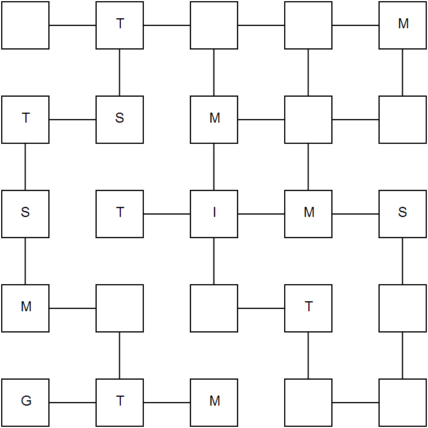

# HTN formalization
:suspect: HTN Planning Assignment

**Felipe Meneguzzi**  
**Mauricio Magnaguagno (PhD Student)**  
**Ramon Fraga Pereira (PhD Student)**

Assigned: Thursday, September 22
Due: Thursday, September 29, 9h50am (final deadline Saturday October 1st, with discounts)

Domain adapted from the [2016 The Fifth International Competition on Knowledge Engineering for Planning and Scheduling (ICKEPS)](https://helios.hud.ac.uk/scommv/ICKEPS/Scenarios.pdf), credits to [Dr. Lukas Chrpa](https://helios.hud.ac.uk/scomlc/) for the scenario.

RPG Domain
==================

You must work on this project **individually**. You are free to discuss high-level design issues with the people in your class, but every aspect of your actual formalisation must be entirely your own work. Furthermore, there can be no textual similarities in the reports generated by each student. Plagiarism, no matter the degree, will result in forfeiture of the entire grade of this assignment.

For this assignment, you can choose between two open source implementation of HTN planning: <span style="font-variant:small-caps;">[JShop2](https://sourceforge.net/projects/shop/files/JSHOP2/)</span> available at [Sourceforge](https://sourceforge.net/projects/shop/files/JSHOP2/) or HyperTensioN available at [GitHub](https://github.com/Maumagnaguagno/HyperTensioN). You can obtain a copy of these softwares from their project site. Your deliverables must be handed in via Moodle using the correspondingly named upload rooms. At the end of this assignment, you will upload **one zip file** containing the domain and problem specification files in the **.jshop** format, specifically:

-   one file named `rpg.jshop` containing the domain encoding;

-   three files containing the problems you formalised, named `pb\sigma.jshop`, where `\sigma` is the sequential number of your problem, e.g. `pb1.jshop`, `pb2.jshop`, `pb3.jshop`;

-   the same number of files (with similar names) showing the traces created for the problems you created (e.g. `pb1.jshop` and `pb1.txt`); and

-   one report following the guidelines detailed below.

Overview
========

In this assignment you will formalise HTN methods for the RPG domain.

> [Recall the RPG Domain description you formalized in PDDL](https://github.com/pucrs-automated-planning/pddl-formalization).

For this project, you will model the domain knowledge encoded as methods in an HTN domain specification. The hero has four operations available to him/her:

- The hero can **move** to an adjacent room (connected by a corridor) that has not been destroyed (i.e., the hero has not yet visited the room);
- The hero can **pickup** the sword if it is present in the room the hero is currently in and the hero is empty handed;
- S/He can also **destroy** the sword the hero currently holds. However, this can have unpleasant effects if done in a room with a trap or a monster;
- Finally, the hero can **disarm** a trap, if there is a trap in the room the hero is in and the hero is empty-handed (does not hold a sword), then the hero can disarm it.

You can (and we encourage you to) use the operators (action templates) as defined below:

```LISP
    ; This is a comment
    (:operator (!move ?room1 ?room2)
        (;preconditions - simulate PDDL tags with comments
            (connected ?room1 ?room2)
            (at ?room1)
            (not (destroyed ?room2))
            (not (trap-in ?room1))
            ; Either test the following disjunction here or in the preconditions of methods
            ;(or
            ;  (not (handempty))
            ;  (not (monster-in ?room))
            ;)
        )
        (; delete effects
            (at ?room1)
        )
        (; add effects
            (destroyed ?room1)
            (at ?room2)
        )   
    )
    
    (:operator (!pickup ?room)
        (;preconditions
            (handempty)
            (sword-in ?room)
            (at ?room)
        )
        (; delete effects
            (sword-in ?room)
            (handempty)
        )
        (; add effects
        
        )
    )

    (:operator (!destroy ?room)
        (;preconditions
            (at ?room)
            (not (trap-in ?room))
            (not (monster-in ?room))
            (not (handempty))
        )
        (; delete effects
        
        )
        (; add effects
            (handempty)
        )
    )

    (:operator (!disarm ?room)
        (;preconditions
            (handempty)
            (at ?room)
            (trap-in ?room)
        )
        (; delete effects
            (trap-in ?room)
        )
        (; add effects
        
        )
    )
```

Your assignment is to develop a domain file using the specification above, and encode domain knowledge that will help the HTN planner to finish the task. The following hints may be useful, but you are welcome to use your creativity as long as you adhere to the specification above:

-   You do not need extra actions (in fact, they are already prepared for you in this package under [rpg.shop](htn/rpg.shop)), but you may need to create "bookkeeping" actions to keep track of the locations you have tried to decompose methods to;

-   In JSHOP2, bookkeeping actions are encoded using double exclamation marks ```(:operator (!!mark ?room) ...)```

-   You will need a recursive method to make the agent travel all the way to a particular location;

-   There are domains that do search over grid space in the examples included in JSHOP2, you may want to look at the [rover](jshop2/examples/rover) domain; and

-   You may need specific methods to travel that use the operator above.

Problem Instances
=================

We illustrate the problem instances that you need to model in HTN in the pictures below, once you are done encoding your domain file. The text that accompanies each image is self-explanatory; remember, you must model corridors between rooms, rooms for the hero to move through, and you can only move between connected rooms and visit each room only **once**. 
We specify the problems so that cells stand for rooms and edges between them represent corridors. 
“I” is the hero's initial position, “G” is hero's desired goal position, “S” indicates a sword, “M” is a monster, and “T” stands for trap.

## Problem 1


## Problem 2


## Problem 3



Grading
=======

In order to properly evaluate your work and thought process, you will write a 2-page report in the AAAI conference format explaining your encoding and experiments. These guidelines are to be followed **exactly**. **Reports that are less than two pages of actual content, or not in format will receive 0 marks for the report criterion.** This report will be included in the deliverables of **Part B** of the assignment. [The formatting instructions are available at ShareLatex (AAAI Press)](https://pt.sharelatex.com/templates/journals/aaai-press). The report must have the following sections:

-   An introduction with your understanding of the problem domain, outlining the remainder of the paper;

-   Two domain formalisation sections explaining your approach to formalising the problems from the problems instance section 

-   One experimentation section where the performance of the HTN planner is measured using your domain knowledge for each of the domains, on multiple problems.

-   One conclusion section, where you will summarise your experience in encoding planning domains and discuss the performance of <span style="font-variant:small-caps;">JShop2</span>, and any limitations encountered in solving the problems you encoded.

Grading will take into consideration elements of your encoding, experimentation and reporting of the work done. The criteria, as well as their weight in the final grade is as follows:

-   Domain Encoding (30%) — correctness of the domain knowledge encoding, in relation to the domain specification above;

-   Problem specifications (20%) — correctness of the problem specifications used for the experiments, particularly the initial state specification, as missing predicates here will jeopardise <span style="font-variant:small-caps;">JShop2</span>’s ability to solve your problem;

-   Overall report readability (20%) — how accessible and coherent your explanation of your encoding is;

-   Experiments (30%) — how coherent the proposed experiments are in measuring the performance of <span style="font-variant:small-caps;">JShop2</span>, notice that this criteria is complementary to the one regarding problem specification.

Miscellaneous Advice
====================

Here are some lessons we learned in creating our own solution and writing papers/reports:

-   As a first step, you should at least look at the sample domain and problem files included in the <span style="font-variant:small-caps;">JShop2</span> package.

-   The best way to figure out how to model a domain and associated problems is to look at these examples. If you feel the need for documentation, there is a complete manual included in the package from Sourceforge as well as the one from moodle.

-   Tables and graphs are a useful tool to show runtime performance of software. GnuPlot is an excellent (and free) graph making software, available at [Gnuplot](http://www.gnuplot.info/);

-   In order to evaluate the performance of a planning encoding, you need to specify problems with most of the parameters locked in, and measure runtime as one parameter increases (e.g. number of locations, number of containers, etc);

-   Pasting your entire domain specification (or problems) into the paper does not count as content (now you cannot say you were not warned);

-   Overly large figures used to simply fill space in the report are also not a good idea;

-   Reviewers have a more pleasant reading experience when papers are generated using <span style="font-variant:small-caps;">LaTeX</span>, it is very easy to spot the difference.
